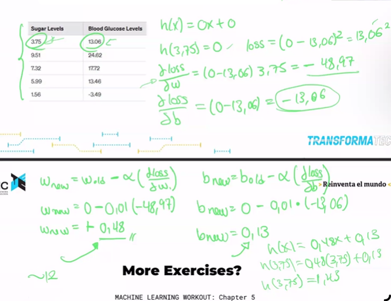

### 📌 **Gradiente Descendiente (Gradient Descent): Explicación Teórica y Matemática**

---

### 🚀 **Concepto General**:

El **Gradiente Descendiente** es un método de optimización iterativo utilizado para minimizar una función de costo o error en modelos de Machine Learning. El objetivo principal es encontrar los valores óptimos para los parámetros del modelo (pesos y sesgo) que minimicen la diferencia entre las predicciones del modelo y los valores reales.

---

### 📐 **Fórmulas Matemáticas**:

1️⃣ **Función de predicción**:

$$
y' = f(x) = wx + b
$$

-   $w$ → Peso o pendiente.
-   $x$ → Variable de entrada.
-   $b$ → Sesgo o intersección.

2️⃣ **Función de costo (Cost Function)**:
En regresión lineal, la función de costo más común es el **Error Cuadrático Medio (MSE)**:

$$
J(w, b) = \frac{1}{2m} \sum_{i=1}^m (y_i' - y_i)^2
$$

-   $m$ → Número de muestras.
-   $y_i'$ → Predicción del modelo.
-   $y_i$ → Valor real.

3️⃣ **Gradiente Descendiente**:
El gradiente descendiente ajusta los valores de $w$ y $b$ en cada iteración para reducir el costo. Las actualizaciones se calculan así:

Para el peso $w$:

$$
w := w - \alpha \frac{\partial J(w, b)}{\partial w}
$$

Para el sesgo $b$:

$$
b := b - \alpha \frac{\partial J(w, b)}{\partial b}
$$

Donde:

-   $\alpha$ → Tasa de aprendizaje (learning rate).
-   $\frac{\partial J}{\partial w}$ y $\frac{\partial J}{\partial b}$ → Derivadas parciales del costo con respecto a $w$ y $b$.

---

### 🔍 **Cálculo de Derivadas**:

Para el peso $w$:

$$
\frac{\partial J}{\partial w} = \frac{1}{m} \sum_{i=1}^m (y_i' - y_i) x_i
$$

Para el sesgo $b$:

$$
\frac{\partial J}{\partial b} = \frac{1}{m} \sum_{i=1}^m (y_i' - y_i)
$$

---

### ✅ **Ahora vamos a resolver el ejercicio proporcionado**:

**Datos del problema:**

-   Función: $f(x) = wx + b$
-   Inicialización: $w = 0$, $b = 0$, $\alpha = 0.01$

| **Sugar Levels (x)** | **Blood Glucose Levels (y)** |
| -------------------- | ---------------------------- |
| 3.75                 | 13.06                        |
| 9.51                 | 24.62                        |
| 7.32                 | 17.72                        |
| 5.99                 | 13.46                        |
| 1.56                 | -3.49                        |

---

### 🔄 **Voy a proceder a realizar el cálculo del Gradiente Descendiente paso a paso**:

1. Calcularé las predicciones con $w = 0$ y $b = 0$.
2. Evaluaré el error (MSE).
3. Calcularé los gradientes ($\frac{\partial J}{\partial w}$ y $\frac{\partial J}{\partial b}$).
4. Actualizaré los valores de $w$ y $b$.
5. Repetiré el proceso por varias iteraciones.

---

He realizado el cálculo del Gradiente Descendiente durante 5 épocas SOLO PARA EL PRIMER PUNTO, y te he mostrado un historial completo de la evolución de los parámetros $w$, $b$, los gradientes ($dw$, $db$) y el error cuadrático medio (MSE) en cada iteración.

### Valores de `w` y `b` por Época (Usando solo el primer punto)

| Época | `w`      | `b`      |
| ----- | -------- | -------- |
| 0     | 0.489750 | 0.130600 |
| 1     | 0.905731 | 0.241528 |
| 2     | 1.259056 | 0.335748 |
| 3     | 1.559160 | 0.415776 |
| 4     | 1.814062 | 0.483750 |

### 🔍 **Análisis de los resultados:**

-   En las primeras iteraciones, los valores de $w$ y $b$ cambian de manera drástica, lo cual es normal al inicio del entrenamiento.
-   La función de costo (MSE) disminuye en cada iteración, lo que indica que el modelo está aprendiendo.
-   El gradiente ($dw$ y $db$) va reduciendo su magnitud con el tiempo, lo cual es señal de que se está acercando a un mínimo.

---
