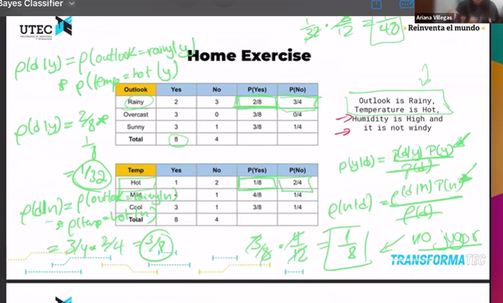

# Resumen de Naive Bayes Classifier

## 1. Introducción a la Clasificación

-   El **problema de clasificación** consiste en asignar una clase o etiqueta a un dato o instancia desconocida basándonos en atributos observados.
-   Por ejemplo, clasificar un insecto con base en la longitud de sus antenas: ¿es un saltamontes o un chapulín?
-   La clasificación usa la probabilidad de pertenencia de una instancia a cada clase dado sus características observadas, y se elige la clase con la mayor probabilidad.

---

## 2. Fundamentos de Naive Bayes

-   Es un clasificador probabilístico basado en **el teorema de Bayes**.
-   Busca calcular la probabilidad posterior de una clase $c_j$ dado los datos observados $d$:

    $$
    p(c_j | d)
    $$

-   El clasificador predice la clase que maximiza esta probabilidad.

---

## 3. Teorema de Bayes

$$
p(c_j | d) = \frac{p(d | c_j) p(c_j)}{p(d)}
$$

-   **$p(c_j)$**: Probabilidad a priori de la clase $c_j$.
-   **$p(d | c_j)$**: Probabilidad de observar los datos $d$ dado que la clase es $c_j$ (verosimilitud).
-   **$p(d)$**: Probabilidad total de observar los datos $d$ (evidencia).

---

## 4. Suposición "Naive" (Independencia Condicional)

-   La clave de Naive Bayes es la **suposición ingenua de que los atributos son independientes** dado la clase.
-   Esto simplifica la verosimilitud:

    $$
    p(d | c_j) = \prod_{i=1}^n p(d_i | c_j)
    $$

    donde $d_i$ es el valor del atributo $i$.

---

## 5. Ejemplo Práctico con Fórmulas

**Contexto:**
Queremos predecir si una persona jugará golf hoy basándonos en las condiciones climáticas. Los atributos son: Outlook (soleado, nublado, lluvioso), Temperatura (caliente, templado, frío), Humedad (alta, normal) y Viento (sí/no).

Dado un día con Outlook = "soleado", Temperatura = "templado", Humedad = "alta" y Viento = "no", queremos predecir si la persona jugará golf.

---

**Paso 1: Probabilidades a priori**

-   $P(\text{Jugar=Sí}) = \frac{9}{14}$
-   $P(\text{Jugar=No}) = \frac{5}{14}$

---

**Paso 2: Probabilidades condicionales de los atributos**

| Atributo    | Valor    | $P(\text{Valor} \mid \text{Jugar=Sí})$ | $P(\text{Valor} \mid \text{Jugar=No})$ |
| ----------- | -------- | -------------------------------------- | -------------------------------------- |
| Outlook     | Soleado  | $ \frac{2}{9} $                        | $ \frac{3}{5} $                        |
| Temperatura | Templado | $ \frac{4}{9} $                        | $ \frac{2}{5} $                        |
| Humedad     | Alta     | $ \frac{3}{9} $                        | $ \frac{4}{5} $                        |
| Viento      | No       | $ \frac{6}{9} $                        | $ \frac{2}{5} $                        |

---

**Paso 3: Calcular la probabilidad posterior para "Sí" y "No"**

$$
p(\text{Sí} | d) \propto P(\text{Sí}) \times \prod_{i} P(\text{atributo}_i | \text{Sí}) = \frac{9}{14} \times \frac{2}{9} \times \frac{4}{9} \times \frac{3}{9} \times \frac{6}{9} \approx 0.0127
$$

$$
p(\text{No} | d) \propto P(\text{No}) \times \prod_{i} P(\text{atributo}_i | \text{No}) = \frac{5}{14} \times \frac{3}{5} \times \frac{2}{5} \times \frac{4}{5} \times \frac{2}{5} \approx 0.0137
$$

---

**Paso 4: Decisión**
Como $p(\text{No} | d) > p(\text{Sí} | d)$, se predice que la persona **no jugará golf** ese día.

---

## 6. Ventajas de Naive Bayes

-   Entrenamiento y clasificación rápidos.
-   No sensible a características irrelevantes.
-   Maneja datos reales y discretos.
-   Funciona bien con datos en streaming.

---

## 7. Desventajas y Limitaciones

-   Suposición fuerte de independencia entre atributos.
-   Sensible al problema de cero-frecuencia (combinaciones no vistas).

---

## 8. Tipos de Naive Bayes según el tipo de datos

-   Gaussian Naive Bayes para datos continuos.
-   Multinomial Naive Bayes para datos de conteo.
-   Bernoulli Naive Bayes para datos binarios.

---

## 9. Proceso General

1. Calcular probabilidades a priori por clase.
2. Calcular probabilidades condicionales de atributos por clase.
3. Para una nueva instancia, calcular la probabilidad posterior para cada clase.
4. Elegir la clase con mayor probabilidad posterior.

---

## 10. Takeaways Finales

-   Clasificador simple pero efectivo basado en probabilidad.
-   Asunción de independencia clave.
-   Rápido y útil para datos categóricos y continuos.
-   Importante manejar adecuadamente el problema de frecuencias cero.

---

