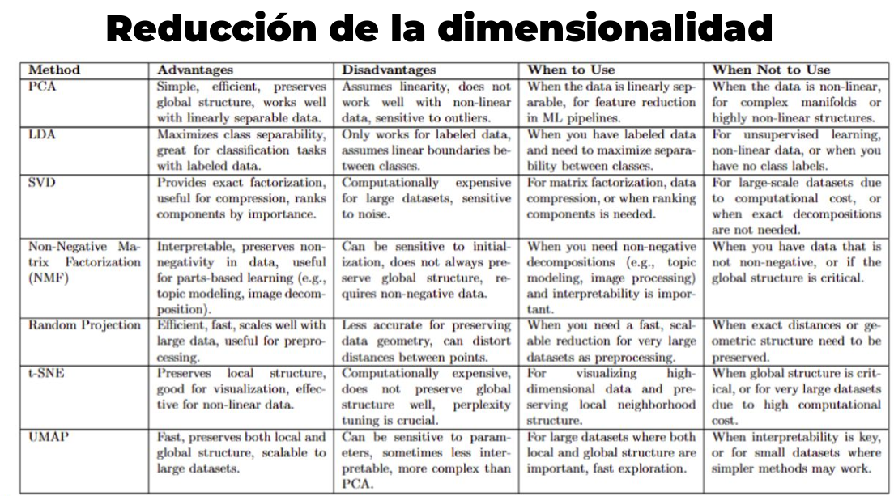

---

# Resumen: Reducción de Dimensionalidad II

---

## 1. Introducción general

-   Este documento presenta técnicas avanzadas de reducción de dimensionalidad para datos complejos, donde las relaciones no son solo lineales.
-   Complementa las técnicas lineales vistas antes (como PCA) con métodos supervisados, no lineales y basados en modelos probabilísticos o geométricos.

---

## 2. Técnicas principales

### a) Non-negative Matrix Factorization (NMF)

-   Descompone una matriz de datos en dos matrices con valores **no negativos**.
-   Permite interpretar los datos como combinaciones aditivas de bases.
-   Ideal para datos como imágenes o texto donde no hay valores negativos.
-   La matriz $X$ se aproxima por:

$$
X \approx W H^T
$$

donde $W$ son las bases y $H$ las activaciones.

---

### b) Linear Discriminant Analysis (LDA)

-   Técnica **supervisada** que busca transformar los datos para maximizar la separación entre clases y minimizar la variabilidad dentro de cada clase.
-   Idea clave: encontrar un espacio proyectado donde las medias de las clases estén lo más separadas posible y las varianzas dentro de cada clase sean pequeñas.
-   Se basa en el criterio de Fisher:

$$
J(w) = \frac{w^T S_b w}{w^T S_w w}
$$

con $S_b$ matriz de dispersión entre clases y $S_w$ matriz de dispersión dentro de clases.

---

### c) Proyecciones Aleatorias (Random Projections)

-   Proyecta datos a un espacio de menor dimensión usando matrices aleatorias.
-   Garantiza preservar aproximadamente las distancias entre puntos según el Teorema de Johnson-Lindenstrauss.
-   Muy eficiente computacionalmente.
-   Ideal para preprocesar datos grandes cuando se busca rapidez.

---

### d) Métodos No Lineales: t-SNE y UMAP

-   **t-SNE (t-distributed Stochastic Neighbor Embedding):**

    -   Método probabilístico que preserva relaciones locales entre puntos.
    -   Mapea datos de alta dimensión a espacios bajos (2D o 3D) para visualización.
    -   Resalta agrupamientos naturales (clusters) en los datos.

-   **UMAP (Uniform Manifold Approximation and Projection):**

    -   Similar a t-SNE pero más rápido y capaz de preservar tanto estructura global como local.
    -   Basado en teoría topológica (manifold learning).
    -   Muy usado para visualización y análisis exploratorio.

---

## 3. Tabla comparativa mejorada de técnicas de reducción de dimensionalidad

| Técnica                | Supervisado | Lineal/No lineal   | Preservación                  | Aplicaciones              | Ventajas clave                             | Limitaciones                                |
| ---------------------- | ----------- | ------------------ | ----------------------------- | ------------------------- | ------------------------------------------ | ------------------------------------------- |
| **PCA**                | No          | Lineal             | Varianza global               | Compresión, visualización | Simple, eficiente                          | Solo relaciones lineales                    |
| **LDA**                | Sí          | Lineal             | Separabilidad clases          | Clasificación supervisada | Maximiza separación de clases              | Suposiciones gaussianas, clases balanceadas |
| **NMF**                | No          | Lineal             | Estructura aditiva            | Texto, imágenes           | Interpretabilidad, aditivo                 | Solo datos no negativos                     |
| **Random Projections** | No          | Lineal (aleatoria) | Distancias aproximadas        | Grandes datasets          | Rápido y simple                            | Pérdida de interpretabilidad                |
| **t-SNE**              | No          | No lineal          | Relaciones locales            | Visualización             | Destaca clusters locales                   | Computacionalmente costoso                  |
| **UMAP**               | No          | No lineal          | Relaciones globales y locales | Visualización             | Rápido, preserva estructura global y local | Parámetros sensibles                        |

---

## 4. Conclusión

-   No existe una única técnica “mejor”; la elección depende de:

    -   Si se tiene información de clases (supervisión).
    -   El tipo de estructura de los datos (lineal o no lineal).
    -   La escala y tamaño del dataset.
    -   El objetivo (visualización, clasificación, compresión).

-   Métodos como **LDA** son ideales para clasificación supervisada.

-   Métodos como **t-SNE** y **UMAP** son excelentes para visualización y exploración de datos complejos.

---

