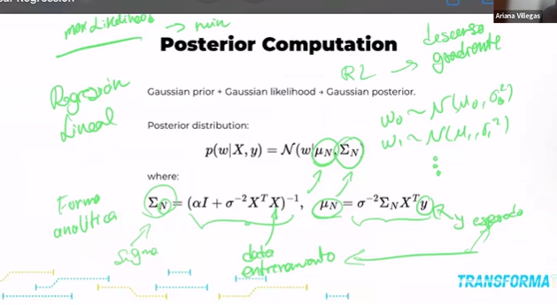
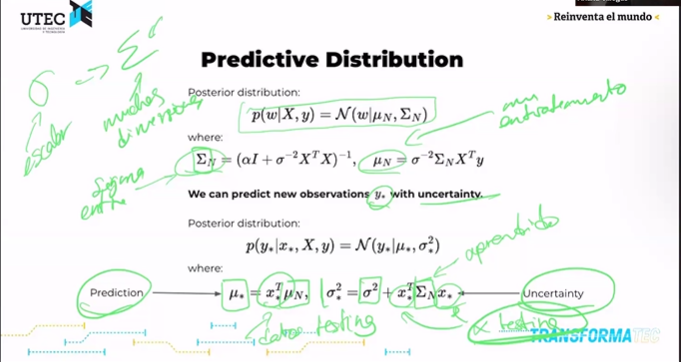

# Resumen Detallado de Regresión Lineal Bayesiana

---

## 1. Maximum Likelihood (Máxima Verosimilitud)

-   El enfoque clásico para estimar parámetros es encontrar aquellos que **maximicen la probabilidad de observar los datos dados esos parámetros**.
-   En regresión lineal con ruido Gaussiano, la función de verosimilitud es:

$$
p(\mathbf{y} | \mathbf{X}, \mathbf{w}) = \prod_{i=1}^N \mathcal{N}(y_i | \mathbf{w}^\top \mathbf{x}_i, \sigma^2)
$$

-   Aquí, $\mathcal{N}(\mu, \sigma^2)$ representa una distribución normal, que necesita especificar dos parámetros:

    -   **Media** $\mu$, que en este caso es la predicción $\mathbf{w}^\top \mathbf{x}_i$.
    -   **Varianza** $\sigma^2$, que modela el ruido o variabilidad de los datos.

-   Se busca el valor de $\mathbf{w}$ que maximice esta función, es decir:

$$
\hat{\mathbf{w}} = \arg\max_{\mathbf{w}} p(\mathbf{y} | \mathbf{X}, \mathbf{w})
$$

-   En la práctica se maximiza el **log-likelihood** (logaritmo de la verosimilitud) para facilitar los cálculos.

-   El resultado es una estimación puntual de los parámetros $\mathbf{w}$.

-   **Takeaway:**
    La verosimilitud cuantifica **qué tan bien los parámetros explican los datos observados**.

---

## 2. Concepto Básico: ¿Qué es la Regresión Lineal Bayesiana?

La regresión lineal bayesiana es una extensión del modelo clásico de regresión lineal que incorpora un marco probabilístico para modelar la incertidumbre en los parámetros del modelo y en las predicciones.

-   **En la regresión clásica (frecuentista)**: se busca un único conjunto de parámetros $\mathbf{w}$ que maximice la verosimilitud de los datos (MLE). Esto significa encontrar el "mejor" $\mathbf{w}$ fijo.

-   **En la regresión bayesiana**: los parámetros $\mathbf{w}$ no son valores fijos sino **variables aleatorias** con una distribución de probabilidad. Esto refleja la incertidumbre que existe sobre cuál es el valor verdadero de $\mathbf{w}$.

-   **Takeaway:**
    La regresión bayesiana **trata los parámetros como variables aleatorias**, no como valores puntuales.

---

## 3. Fundamentos Matemáticos

### 3.1 Likelihood (Verosimilitud)

Dado un conjunto de datos $\mathcal{D} = \{(x_i, y_i)\}_{i=1}^N$, donde cada $y_i$ es generado a partir del modelo lineal:

$$
y_i = \mathbf{w}^\top \mathbf{x}_i + \epsilon_i
$$

con $\epsilon_i \sim \mathcal{N}(0, \sigma^2)$ (ruido Gaussiano), la función de verosimilitud para los datos dados los parámetros $\mathbf{w}$ es:

$$
p(\mathbf{y} | \mathbf{X}, \mathbf{w}) = \prod_{i=1}^N \mathcal{N}(y_i | \mathbf{w}^\top \mathbf{x}_i, \sigma^2)
$$

-   Aquí la distribución normal $\mathcal{N}(\mu, \sigma^2)$ está definida por la **media** $\mu = \mathbf{w}^\top \mathbf{x}_i$ y la **varianza** $\sigma^2$, que refleja el ruido o incertidumbre inherente en los datos.
-   Esto mide qué tan probable es observar los datos si conocemos los parámetros $\mathbf{w}$.

### 3.2 Priori (Distribución Previa)

Antes de observar los datos, se tiene una creencia sobre la distribución de los parámetros $\mathbf{w}$. En regresión bayesiana, se suele asumir:

$$
p(\mathbf{w}) = \mathcal{N}(\mathbf{w} | \mathbf{0}, \alpha^{-1} \mathbf{I})
$$

donde $\alpha$ es un parámetro que controla la varianza del prior (la confianza en que los pesos son cercanos a cero).

### 3.3 Posteriori (Distribución Posterior)

Aplicando el teorema de Bayes, la distribución posterior de $\mathbf{w}$ dado los datos $\mathcal{D}$ es:

$$
p(\mathbf{w} | \mathbf{X}, \mathbf{y}) = \frac{p(\mathbf{y} | \mathbf{X}, \mathbf{w}) \, p(\mathbf{w})}{p(\mathbf{y} | \mathbf{X})}
$$

-   **Numerador:** combina la verosimilitud con el prior, reflejando cómo los datos actualizan nuestra creencia inicial.
-   **Denominador:** evidencia o normalizador que asegura que la posterior sea una distribución válida.

### 3.4 Resultados Importantes para Gaussiano + Gaussiano

-   Cuando el prior y la verosimilitud son Gaussianos, la posterior también es Gaussiana, con media y covarianza analíticamente calculables.
-   Esto permite obtener una expresión cerrada para la distribución de los parámetros, sin necesidad de métodos numéricos complejos.

---

## 4. Predicción Bayesiana

En lugar de predecir un único valor $\hat{y}$, la regresión bayesiana produce una **distribución predictiva** para un nuevo punto $x_*$:

$$
p(y_* | x_*, \mathbf{X}, \mathbf{y}) = \int p(y_* | x_*, \mathbf{w}) p(\mathbf{w} | \mathbf{X}, \mathbf{y}) \, d\mathbf{w}
$$

-   Esta integral incorpora la incertidumbre sobre $\mathbf{w}$.

-   El resultado es una distribución Gaussiana para $y_*$ con una media predictiva y una varianza que refleja la confianza del modelo.

-   Esto es crucial para escenarios donde la incertidumbre importa (ej. toma de decisiones médicas, finanzas).

-   **Takeaway:**
    La distribución predictiva incorpora la **incertidumbre** en la predicción.

---

## 5. Diferencias con el enfoque Frecuentista

| Aspecto                      | Frecuentista                        | Bayesiano                                    |
| ---------------------------- | ----------------------------------- | -------------------------------------------- |
| Parámetros                   | Estimación puntual (un valor)       | Distribución de parámetros (incertidumbre)   |
| Incertidumbre en parámetros  | No modelada explícitamente          | Modela incertidumbre en $\mathbf{w}$         |
| Predicción                   | Valor puntual                       | Distribución predictiva con media y varianza |
| Interpretación de resultados | Parámetros fijos desconocidos       | Parámetros aleatorios con creencias previas  |
| Manejo de datos nuevos       | Nuevo modelo o estimación necesaria | Se actualiza la posterior con nuevos datos   |

---

## 6. Aplicaciones y ventajas

-   Proporciona intervalos de confianza en predicciones, no solo puntos estimados.

-   Muy útil cuando el costo de errores es alto y se necesita gestionar riesgos.

-   Modela explícitamente la incertidumbre sobre los parámetros.

-   Soluciones cerradas para modelos lineales con ruido gaussiano.

-   Base para modelos más complejos en aprendizaje automático bayesiano.

-   **Takeaway:**
    Muy valioso cuando las **estimaciones de incertidumbre son críticas**, por ejemplo, en escenarios de toma de decisiones.

---

## 7. Resumen visual del proceso bayesiano

1. Definir prior $p(\mathbf{w})$.
2. Obtener verosimilitud $p(\mathbf{y}|\mathbf{X}, \mathbf{w})$.
3. Calcular posterior $p(\mathbf{w}|\mathbf{X}, \mathbf{y})$ con Bayes.
4. Predecir para nuevo dato $x_*$ integrando sobre posterior.

---

